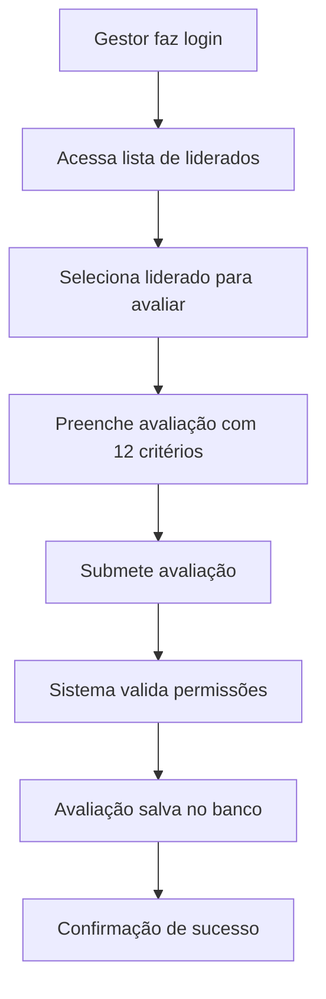

# Avaliações de Gestores

Esta pasta contém as funcionalidades para gestores avaliarem seus liderados no sistema de Performance Management.

## 📁 Estrutura

```
evaluations/manager/
├── README.md              # Este arquivo de documentação
└── (interfaces em ../models/evaluations/manager/)
```

## 🎯 Funcionalidades

### 1. Avaliação de Liderados
**Endpoint:** `POST /api/evaluations/manager/subordinate-assessment`

Permite que gestores avaliem seus liderados utilizando os 12 critérios padrão do sistema.

#### Regras de Negócio:
- ✅ Apenas usuários com role `MANAGER` em pelo menos um projeto podem usar
- ✅ Gestor só pode avaliar liderados dos projetos onde ele é gestor
- ❌ Não pode avaliar a si mesmo
- ❌ Não pode avaliar usuário que já foi avaliado no mesmo ciclo
- ✅ Liderado deve existir e estar ativo

#### Critérios de Avaliação:
**Comportamento (5 critérios):**
- Sentimento de Dono
- Resiliência nas Adversidades
- Organização no Trabalho
- Capacidade de Aprender
- Ser "Team Player"

### 2. Listar Liderados Disponíveis
**Endpoint:** `GET /api/evaluations/manager/subordinates`

Retorna todos os liderados que o gestor pode avaliar, agrupados por projeto.

#### Regras:
- ✅ Apenas gestores podem acessar
- ✅ Retorna usuários dos projetos onde o gestor tem role `MANAGER`
- ✅ Agrupa por projeto
- ✅ Exclui o próprio gestor

## 🏗️ Arquitetura

### Modelos de Dados

#### ManagerAssessment
```typescript
interface IManagerAssessment {
  id: string;
  cycle: string;
  authorId: string;        // ID do gestor
  evaluatedUserId: string; // ID do liderado
  status: 'DRAFT' | 'SUBMITTED';
  answers: IManagerAssessmentAnswer[];
  createdAt: Date;
  updatedAt: Date;
}
```

#### ManagerAssessmentAnswer
```typescript
interface IManagerAssessmentAnswer {
  criterionId: ValidCriterionId;
  score: number;     // 1 a 5
  justification: string;
}
```

### Banco de Dados

#### Tabelas Criadas:
- `manager_assessments`: Armazena as avaliações de gestores
- `manager_assessment_answers`: Armazena as respostas para cada critério

#### Relacionamentos:
- `ManagerAssessment` → `User` (gestor/autor)
- `ManagerAssessment` → `User` (liderado/avaliado)
- `ManagerAssessment` → `ManagerAssessmentAnswer[]` (respostas)

## 🔒 Segurança

### Verificações de Permissão:
1. **Autenticação:** JWT obrigatório
2. **Autorização:** Verificação de role `MANAGER`
3. **Contexto:** Verificação de relacionamento gestor-liderado
4. **Duplicação:** Prevenção de avaliações duplicadas

### Guards Aplicados:
- `JwtAuthGuard`: Validação de token
- Verificação manual de permissões no controller/service

## 📊 Fluxo de Trabalho



## 🧪 Exemplo de Uso

### 1. Listar Liderados
```bash
GET /api/evaluations/manager/subordinates
Authorization: Bearer <jwt-token>
```

**Resposta:**
```json
[
  {
    "projectId": "proj-123",
    "projectName": "Projeto Alpha",
    "subordinates": [
      {
        "id": "user-456",
        "name": "João Silva",
        "email": "joao.silva@rocket.com",
        "jobTitle": "Desenvolvedor Senior",
        "seniority": "Senior",
        "role": "COLLABORATOR"
      }
    ]
  }
]
```

### 2. Criar Avaliação
```bash
POST /api/evaluations/manager/subordinate-assessment
Authorization: Bearer <jwt-token>
Content-Type: application/json

{
  "evaluatedUserId": "user-456",
  "cycle": "2025.1",
  "sentimentoDeDonoScore": 4,
  "sentimentoDeDonoJustification": "O colaborador demonstra responsabilidade pelos resultados da equipe e toma iniciativa em projetos importantes.",
  "resilienciaAdversidadesScore": 4,
  "resilienciaAdversidadesJustification": "Mantém-se firme e positivo diante de desafios, adaptando-se bem a mudanças.",
  "organizacaoTrabalhoScore": 5,
  "organizacaoTrabalhoJustification": "Mantém organização pessoal, planeja bem as atividades e gerencia eficientemente o tempo.",
  "capacidadeAprenderScore": 5,
  "capacidadeAprenderJustification": "Demonstra curiosidade, busca constantemente novos conhecimentos e aplica o que aprende.",
  "teamPlayerScore": 5,
  "teamPlayerJustification": "Trabalha bem em equipe, colabora ativamente, compartilha conhecimento e ajuda colegas."
}
```

## 🚀 Futuras Melhorias

### Funcionalidades Planejadas:
- [ ] Histórico de avaliações por liderado
- [ ] Comparação de avaliações entre ciclos
- [ ] Relatórios de performance da equipe
- [ ] Notificações para liderados sobre avaliações
- [ ] Dashboard de gestão de pessoas
- [ ] Exportação de dados para análise

### Otimizações Técnicas:
- [ ] Cache de consultas frequentes
- [ ] Validação de negócio em guards customizados
- [ ] Logs de auditoria detalhados
- [ ] Testes automatizados completos 